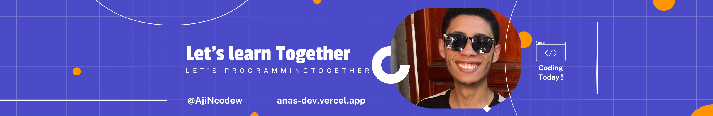

<h1 align="center">Hi 👋, I'm ER-RAKIBI</h1>
<h3 align="center">Full stack Web developer</h3>

  

  

- 🌱 I’m currently learning **React native**

<h3 align="left">Languages and Tools:</h3>

         </a>  

         

&nbsp;
  

